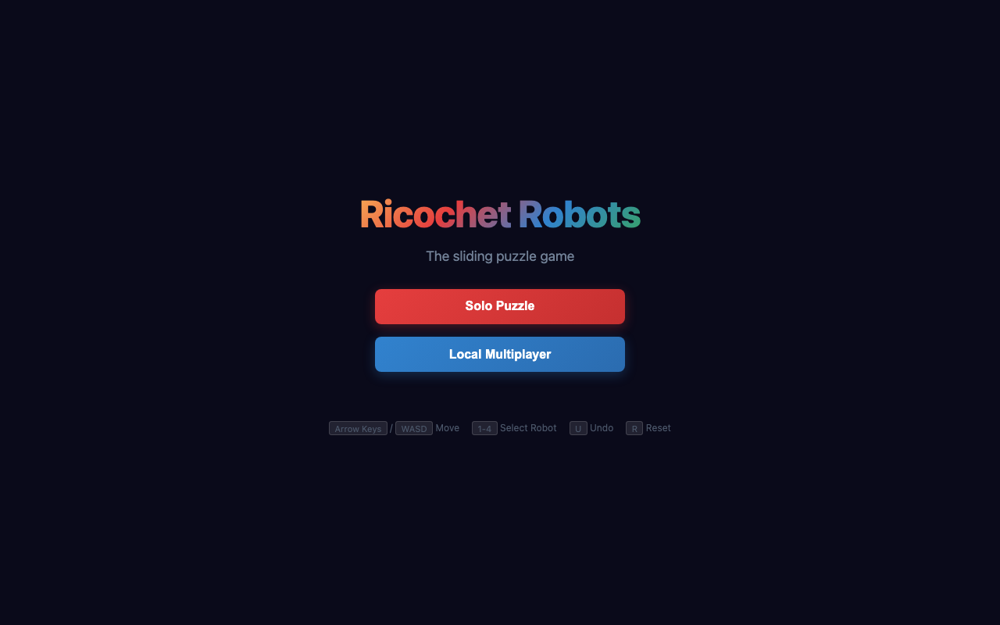
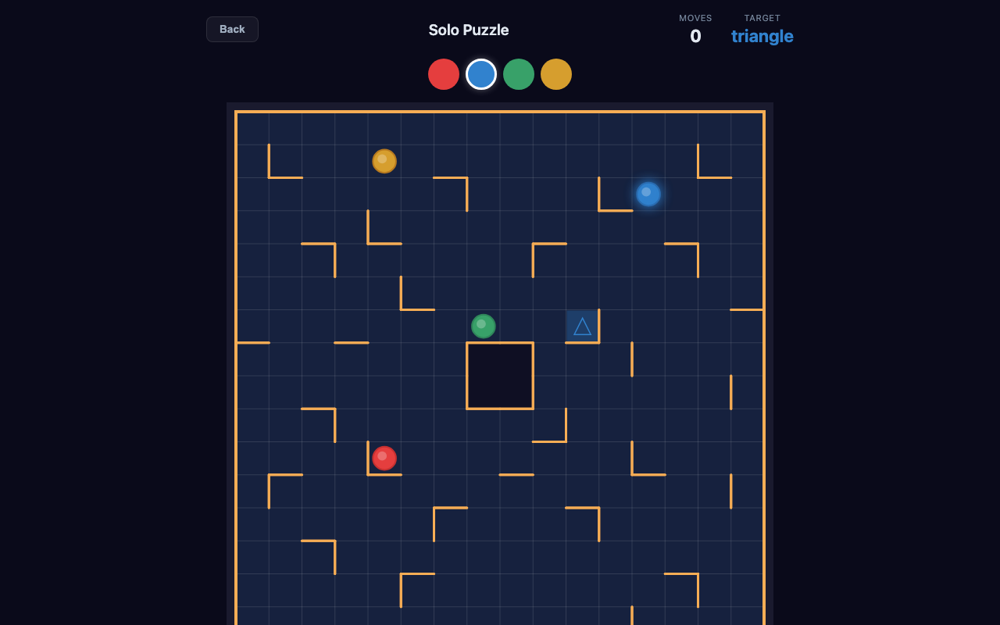
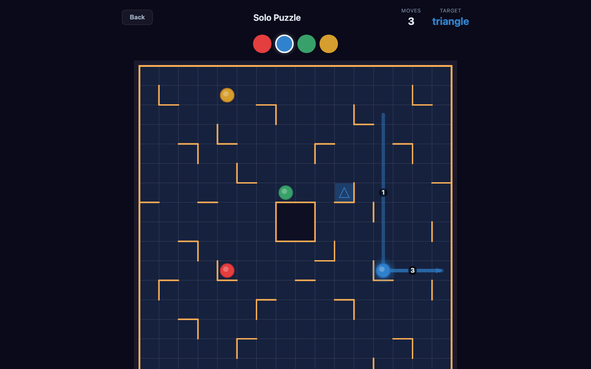
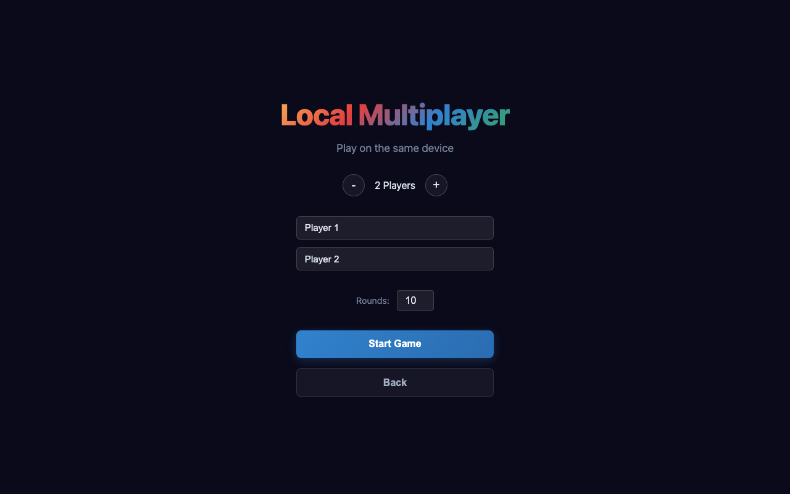
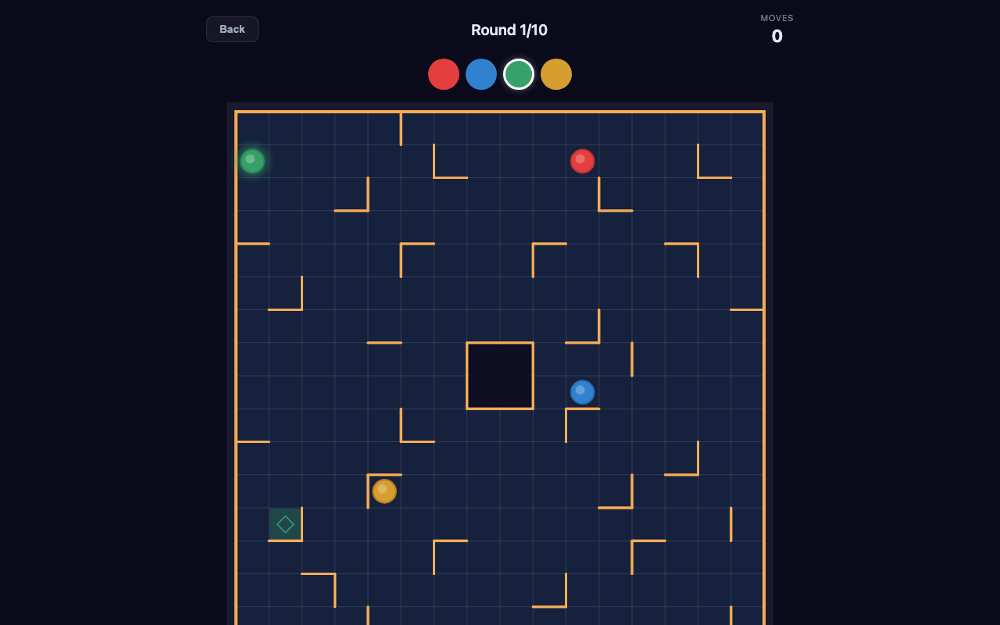

# Ricochet Robots

A browser-based version of the classic [Ricochet Robots](https://en.wikipedia.org/wiki/Ricochet_Robots) board game by Alex Randolph. Play solo puzzles or compete with friends on the same device.

**[Play Now](https://angadsingh-x.github.io/ricochet-robots/)** | **[Staging](https://angadsingh-x.github.io/ricochet-robots/staging/)**



## What is Ricochet Robots?

Ricochet Robots is a puzzle game played on a 16x16 grid. Four colored robots sit on the board, and walls block movement along certain cell edges. Each round, a target is revealed -- a colored shape on a specific cell. Your goal: **slide the matching robot to the target in as few moves as possible**.

The twist: robots slide in a straight line until they hit a wall or another robot. There's no stopping mid-slide. You can move _any_ robot to set up blockers, making this a deeply strategic spatial puzzle.

## How to Play

### The Board



- **Grid**: 16x16 cells with visible grid lines for easy counting
- **Robots**: 4 colored circles -- red, blue, green, yellow
- **Target**: A colored shape (circle, triangle, square, diamond, or star) on a highlighted cell
- **Walls**: Thick orange lines on cell edges that block robot movement
- **Center block**: The 2x2 area in the middle is impassable

### Controls

| Input | Action |
|-------|--------|
| **Click/tap** a robot | Select it |
| **Arrow keys** or **WASD** | Slide selected robot in that direction |
| **1-4** keys | Quick-select robot (1=red, 2=blue, 3=green, 4=yellow) |
| **U** | Undo last move |
| **R** | Reset puzzle to starting positions |

There's also a **D-pad** on screen for mobile/touch play.

### Move Traces



Every move you make leaves a **colored trail** on the board showing:
- **Dashed line** from the starting position to where the robot stopped
- **Arrow** pointing in the direction of movement
- **Numbered circle** (1, 2, 3...) so you can follow the sequence

This is especially useful when the solver plays back the optimal solution -- you can study the full path.

## Game Modes

### Solo Puzzle

Practice solving puzzles at your own pace.

- A random target is revealed each round
- Solve it in as few moves as possible
- **Undo** and **Reset** freely to experiment
- **Show Solution** runs a BFS solver to find and play back the optimal solution
- **Next Puzzle** to move on

### Local Multiplayer



Play with 2-8 players on the same device, faithful to the board game rules:

1. **Thinking phase** (60s timer): Everyone looks at the board and mentally solves the puzzle
2. **Bidding phase**: Each player bids how many moves they think they need
3. **Solving phase**: Lowest bidder goes first and demonstrates their solution
   - Solve within your bid = you score a point
   - Fail = next bidder tries
4. Repeat for the configured number of rounds



## Tech Stack

- **TypeScript** + **Vite** -- fast dev, type-safe game logic
- **HTML Canvas** -- board rendering with animations
- **BFS Solver** -- finds optimal solutions for any puzzle
- **Zero dependencies** -- no React, no frameworks, just vanilla TS
- **~9KB gzipped** -- loads instantly

## Development

```bash
# Prerequisites: Node.js 20+ (use nvm if needed)
nvm use 22

# Install dependencies
npm install

# Start dev server
npm run dev

# Build for production
npm run build

# Deploy to staging (test before going live)
npm run deploy:staging

# Deploy to production (GitHub Pages)
npm run deploy
```

## Credits

Based on the board game **Ricochet Robots** designed by Alex Randolph (1999).

Built with [Claude Code](https://claude.ai/code).
